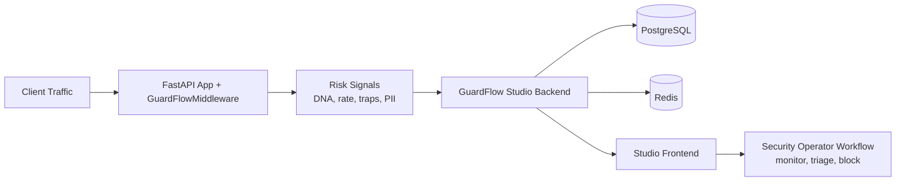

# GuardFlow V1

```text
   ____                      ________
  / ___|_   _  __ _ _ __ __|  ___/ /___ _      __
 | |  _| | | |/ _` | '__/ _` |_  / / __| | /| / /
 | |_| | |_| | (_| | | | (_|  _/ / / (__| |/ |/ /
  \____|\__,_|\__,_|_|  \__,_/_/ /_/\___|__/|__/
```

**Runtime protection for FastAPI. Operational visibility for security teams.**

GuardFlow is a full-stack application security platform built for teams that want
to detect and control abuse traffic in API workloads without slowing delivery.

- **SDK (`SDK/`)**: FastAPI middleware for request DNA fingerprinting, rate limiting,
  honeypot trap detection, and telemetry emission.
- **Studio (`studio/`)**: Security control plane for threat monitoring, analytics,
  blacklist operations, and project/API key lifecycle.

## Why GuardFlow (Problem It Solves)

Most API teams face the same failure mode:

- Abuse traffic is discovered too late (after cost spikes or user impact).
- Signals are fragmented across logs, WAF events, and app traces.
- Blocking is manual, inconsistent, and disconnected from application context.
- Security controls are either too coarse (IP-only) or too expensive to operate.

GuardFlow solves this by combining **in-app detection** (SDK) with a
**dedicated operational surface** (Studio), so teams can move from raw events to
actionable decisions fast.

## Live Product

- Studio: [https://guard-flow-v1.vercel.app/](https://guard-flow-v1.vercel.app/)
- Documentation: [https://guard-flow-v1.vercel.app/docs](https://guard-flow-v1.vercel.app/docs)
- SDK Guide: [https://guard-flow-v1.vercel.app/sdk-guide](https://guard-flow-v1.vercel.app/sdk-guide)
- Repository: [https://github.com/imadudinke/GuardFlow_v1](https://github.com/imadudinke/GuardFlow_v1)

## PyPI Package (`guardflow-fastapi`)

[](https://pypi.org/project/guardflow-fastapi/)
[](https://pypi.org/project/guardflow-fastapi/)
[](https://pepy.tech/projects/guardflow-fastapi)
[](https://pepy.tech/projects/guardflow-fastapi)
[](https://pypi.org/project/guardflow-fastapi/)

```bash
pip install guardflow-fastapi
```

Package URL: [https://pypi.org/project/guardflow-fastapi/](https://pypi.org/project/guardflow-fastapi/)

## Architecture at a Glance



## Core Capabilities

- Request DNA fingerprinting for behavioral identity beyond IP-only controls.
- Tunable rate limiting and burst defense for API endpoint protection.
- Threat telemetry pipeline feeding real-time Studio dashboards.
- Blacklist and enforcement workflows with project-level isolation.
- Privacy-aware metadata strategy with redaction support.
- Responsive operations UI for mobile, tablet, and desktop triage.

## Quick Start

### 1) Protect a FastAPI app

```python
from fastapi import FastAPI
from guardflow.middleware import GuardFlowMiddleware

app = FastAPI()

app.add_middleware(
    GuardFlowMiddleware,
    api_key="gf_live_your_api_key_here",
    redis_url="redis://localhost:6379",
    studio_url="https://guard-flow-v1.vercel.app",
)
```

### 2) Run Studio backend locally

```bash
cd studio/backend
python -m venv .venv
source .venv/bin/activate
pip install -r requirements.txt
uvicorn app.main:app --reload --port 8001
```

### 3) Run Studio frontend locally

```bash
cd studio/frontend
npm install
npm run dev
```

## Repository Structure

```text
GuardFlow_V1/
├── SDK/                  # Python package (guardflow-fastapi)
│   ├── guardflow/        # SDK source
│   └── README.md         # SDK-specific docs
├── studio/
│   ├── backend/          # FastAPI API + auth + telemetry services
│   └── frontend/         # Next.js security operations UI
└── README.md             # Product-level overview (this file)
```

## Intended Users

- **Application teams** securing public and partner-facing FastAPI endpoints.
- **Platform engineers** standardizing API abuse controls across services.
- **Security analysts** who need operationally usable threat signals.

## Operational Notes

- Keep `studio_url` pointed to production Studio for hosted workflows.
- Treat API keys as secrets; rotate on suspicion and scope by project.
- Align SDK and Studio versions during upgrades for predictable telemetry schema.

## License

MIT (see repository license files).
